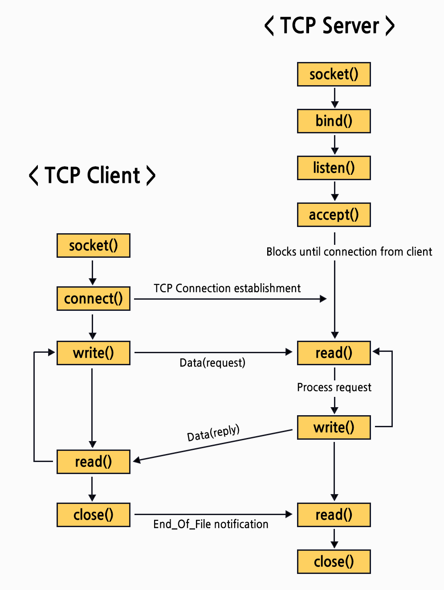

# 0101

- OSI 7계층
- MIME
- Socket 통신

## OSI 7계층

<hr>

### 1계층 - 물리 계층

- 전기적, 기계적 데이터 전송
- 0 or 1, On or Off형태
- 데이터 전달만 함
- 오류제어 X

### 2계층 - 데이터링크 계층

- 인접한 두 장치간 신뢰성 있는 정보 전송
- 오류 탐지, 재전송 기능
- MAC 주소 사용
- 데이터 단위 프레임

### 3계층 - 네트워크 계층

- 라우팅 (최적의 경로 설정)
- IP 주소 사용
- 데이터 단위 패킷

### 4계층 - 전송 계층

- 종단간(송신자 <-> 수신자) 신뢰성 있고 정확한 데이터 전송
- 오류 검출, 복구, 흐름제어, 중복검사
- port 번호 사용
- 데이터 단위 세그먼트

### 5계층 - 세션 계층

- 통신장치 간 동기화
- 연결 세션에서 에러시 복구

### 6계층 - 표현 계층

- 데이터를 표현을 담당
- 송신자(응용계층)의 데이터 부호화
- 수신자의 데이터 압축
- 데이터 암호화 복호화
  - MIME 인코딩?

### 7계층 - 응용 계층

- 사용자의 인터페이스
- 응용 프로세스간 데이터 교환

## MIME

<hr>

- Multipurpose Internet Mail Extensions
- client에게 문서의 타입을 알려주는 메커니즘

과거에는 ASCII 코드를 사용해 email에서 파일을 주고받았지만
사진, 영상 등을 주고받기 시작하면서 ASCII코드로는 파일 전송을 처리할 수 없는 문제점이 생기게 되어 생겨난 것이 MIME이다

- 문법
  ```text
  type/subtype
  ```
  - ex) text/pain, text/css 등등
  - type 종류
    - 개별 타입
      - text
      - image
      - audio
      - video
      - application
    - 멀티파트 타입
      - 여러 파일을 보낼때 사용
      - multipart/form-data
      - multipart/byteranges
        - 브라우저에 개별적인 응답을 보낼때 206 status와 함께 사용

## Socket 통신

<hr>

### Http 통신 VS Socket 통신

- Http 통신
  - client와 server가 응답을 기준으로 ㅇ녀결을 종료함
  - 단방향 통신
- Socket 통신
  - server와 client가 port를 통해 실시간으로 통신
  - 양방향 통신

### Socket 통신 흐름


출처 - https://wildeveloperetrain.tistory.com/122
