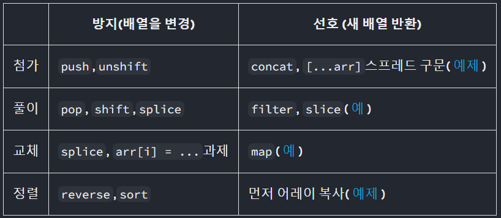

# 0227

- react quick start

## react quick start

---

- jsx empty wrapper
  ```jsx
  return (
    <>
      {" "}
      //empty wrapper
      <div></div>
    </>
  );
  ```
- class name
  ```jsx
  return <div className="avartar"></div>;
  ```
- 표현식
  - curly braces
  ```jsx
  return (
    <>
      
      <div>{data}</div> //curly braces
    </>
  );
  ```
  ```jsx
  return (
    <div
      style={{
        width: user.imageSize,
        height: user.imageSize,
      }}
    ></div>
  );
  ```
- list rendering
  ```jsx
  const listItem = products.map(product =>
  	<li key={product.id}>
  		{[product.data}
  	</li>
  )
  ```
- event
  ```jsx
  return <button onClick={handleClick}>Click me</button>;
  ```
  event handler function을 호출하지 말고 전달만 할것!

### Hook

- use로 시작하는 함수
- 내장 hook도 있고 내장 hook을 사용해 사용자 정의 hook도 만들수 있음

### Component 사용

- tag에 소문자로 시작 → html 참조
- tag에 대문자로 시작 → component 사용
- component 안에서 새로운 component를 정의하지 말것!

### Props

```jsx
function Avatar({ person, size = 100 }) {
  // ...
}

function Avatar(props) {
  // destructuring
  const person = props.person;
}
```

### 조건부 렌더링

- null 반환 (아무런 요소도 반환하지 않음)

### Component Pure

- component는 렌더링 전의 변수나 객체를 변경해서는 안됨
- 동일한 입력이 주어지면 component는 항상 동일한 jsx를 반환해야함

## State

---

- component specific memory
- 상태 업데이트 대기

  ```jsx
  //bad ❌
  const [score, setScore] = useState(0);

  function increment() {
    setScore(score + 1);
  }

  //good ✅
  const [score, setScore] = useState(0);

  //최근 상태에서 변경할것
  function increment() {
    setScore((s) => s + 1);
  }
  ```

- `stopPropagation` vs `preventDefault`
  - `e.stopPropagation()` → 상위 요소로 event handler의 전파를 중지함
  - `e.preventDefault()` → event의 기본 브라우저 동작을 하지 않음
- array state update
  - 객체의 값을 변경 하는것 → ❌
  - 새로운 배열을 할당하는것 → ✅
    
